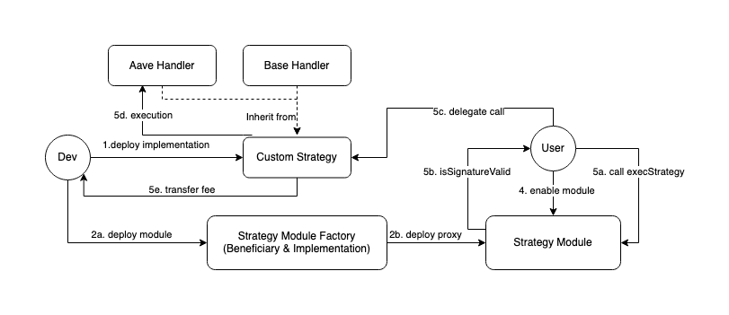

# <p align="center"></p>


# Defi Strategy Module



This contract delegates calls with arbitrary data to external DeFi strategy implementations, known as handlers. Each module is associated with a beneficiary, and these implementations are immutable. It's essential to conduct security checks before enabling and adding them to smart accounts.

## Module Factory

This contract operates as a singleton registry, purpose-built for deploying Strategy Modules while receiving both the strategy implementation and beneficiary as inputs.

## Execute Strategy

To execute arbitrary data on the handler implementation, the module must be enabled, and the strategy transaction must be signed by the Smart Account (SA) owner.

Anyone can execute the strategy by providing the [Execute Strategy](#execute-strategy) of a valid owner. To execute the strategy, you need to call the execStrategy method, which checks the signature and calls the SA to perform the strategy.

The strategy module signatures are EIP-712 based. And uses the following scheme:

- EIP712Domain

```json
{
  "EIP712Domain": [
    { "type": "uint256", "name": "chainId" },
    { "type": "address", "name": "verifyingContract" }
  ]
}
```

- ExecuteStrategy

```json
{
  "ExecuteStrategy": [
    { "type": "address", "name": "handler" },
    { "type": "uint256", "name": "value" },
    { "type": "bytes", "name": "data" },
    { "type": "uint256", "name": "nonce" }
  ]
}
```

## Handlers

Handlers represent an immutable implementation of module strategy utilized within a module factory for deployment. Developers have the flexibility to create their own implementations and deploy corresponding strategies.

- [Handler Library](./contracts/handlers/)

## Approval Mechanism

However, the module strategy factory is permissionless, allowing anyone to deploy their strategy with their handler implementation and add it to their wallet. Nonetheless, unhosted comes with its own approval mechanism, ensuring that only modules that have undergone security checks are displayed. This precaution is in place to prevent the addition of malicious code to users' wallets.

### Considerations

Once the Strategy Module is enabled, it obtains complete ownership of the SA and the ability to delegate calls for executing any external arbitrary data. The approval mechanism plays a vital role in verifying these strategies.

## Running tests

```bash
yarn
yarn test
```

## Compiling contracts

```bash
yarn
yarn build
```
