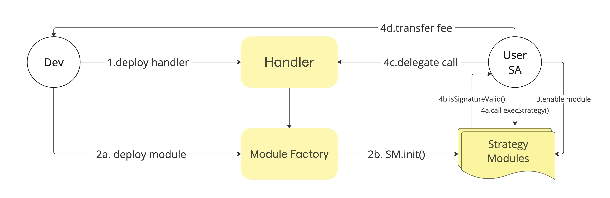

# <p align="center"></p>


# Strategy Module



Unhosted introduces Strategy Modules, enabling the delegatecall from smart account to execute arbitrary logic. This paves the way for an array of functionalities, from automated wallets to one-click DeFi strategies, offering boundless possibilities. At the core of Strategy Modules are [Handlers](#handlers), housing the arbitrary logic. Deploying these modules is permissionless, allowing developers to generate revenue based on user utilization of their modules. The Unhosted ecosystem beckons developers to explore the realm of limitless innovation and potential earnings.

## Strategy Module Factory

After creating your handler, you can utilize the module factory to deploy the strategy module. The module serves as the entry point for executing your strategy and receiving payments. The factory functions as a singleton registry designed for deploying Strategy Modules, acquiring both the strategy implementation ([handlers](#handlers)) and beneficiary (for receiving payments). To make your strategy accessible in the module store, it should be deployed by the module factory.

## Execute Strategy

To execute arbitrary data on the handler implementation, the module must be enabled, and the strategy transaction must be signed by the Smart Account (SA) owner.

Anyone can execute the strategy by providing the [Execute Strategy](#execute-strategy) of a valid owner. The `execStrategy` method, checks the signature and calls the SA to perform the strategy.

The strategy module signatures are EIP-712 based. And uses the following scheme:

- EIP712Domain
  - `verifyingContract` is module address and `salt` is smartAccount converted address
```json
{
  "EIP712Domain": [
    { "type": "uint256", "name": "chainId" },
    { "type": "address", "name": "verifyingContract" }
    { "type": "bytes32", "name": "salt" }
  ]
}
```

- ExecuteStrategy
  - `handler` is module implemntation address
  - `value` is msg.value send with transaction
  - `data` is the arbitrary data to execute
  - `nonce` to validate the transaction for smartAccount
```json
{
  "ExecuteStrategy": [
    { "type": "address", "name": "handler" },
    { "type": "uint256", "name": "value" },
    { "type": "bytes", "name": "data" },
    { "type": "uint256", "name": "nonce" }
  ]
}
```

## Handlers

Handlers represent an immutable implementation of module strategy utilized within a module factory for deployment. Developers have the flexibility to create their own implementations and deploy corresponding strategies.

- We've developed a variety of handlers for widely used DeFi protocols, ready to be employed in crafting your strategy logic. Feel free to utilize this handler library for your purposes.
- [Handler Library](./contracts/handlers/)

## Approval Mechanism

However, the module strategy factory is permissionless, allowing anyone to deploy their strategy with their handler implementation and add it to their wallet. Nonetheless, unhosted comes with its own approval mechanism, ensuring that only modules that have undergone security checks are displayed. This precaution is in place to prevent the addition of malicious code to users' wallets.

### Considerations

Once the Strategy Module is enabled, it obtains complete ownership of the SA and the ability to delegate calls for executing any external arbitrary data. The approval mechanism plays a vital role in verifying these strategies.

## Running tests

```bash
yarn
yarn test
```

## Compiling contracts

```bash
yarn
yarn build
```
